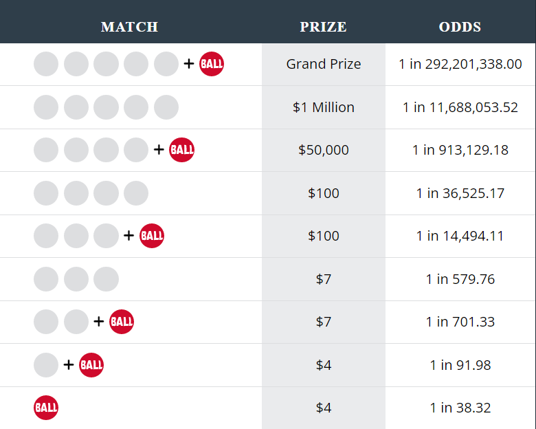

<p align="center">
<a href="url"></a>

# **Magic Bully**
## **Description:** Magic Bully generates random Powerball lottery picks from number pools assigned probability weights from historical draw frequency.  
### **Video Demo:**  <https://youtu.be/NZuktjkQ9IY>

## **Powerball Lottery** 
Powerball is an American lottery game that began on April 22, 1992, across 15 participating states. Today it is held nationwide and drawings occur three nights weekly. Powerball paid out the largest jackpot ever ($1.586 billion) to 3 lucky ticket holders in 2016. On October 7, 2015, the format of the game was adjusted by increasing the white ball pool from 59 to 69 while the red Powerball pool decreased from 35 to 26. This improved the chance of winning any prize to 1 in 24 but increased the jackpot odds to 1 in 292,201,338. For reference, the odds of being struck by lightning are around 1 in a million per year, which is nearly 300 times more likely to happen than winning the jackpot. The best way to improve your odds is to play more numbers, pick numbers with better odds, and be incredibly lucky!

## **How to Play**
- Select five numbers from 1 to 69 for the white balls; then select one number from 1 to 26 for the red Powerball.
- The jackpot grows until won.
- Players win a prize by matching one of the 9 ball combinations.
- [Official Powerball website](http://www.powerball.com/games/home)

## **Prizes and Odds**
<a href="url"></a>

## **How Magic Bully Works**
1. The program calls an API with historical winning Powerball numbers.  
2. Noting that the Powerball format changed in October 2015 to include and exclude several numbers, data from then until the present is only considered to prevent skewing of frequency. The winning numbers are separated into two lists (white/red). 
3. The white and red number lists are counted and sorted into separate descending lists containing key/value pairs (number/occurrences). 
4. The program will now allow the user to optionally play a lucky number. The current version only allows for one lucky number to be played. The user must identify which set (white/red) their number should be played in. 
5. From here the program separates each sorted list (white/red) into two lists maintaining their current order (number/frequency). 
6. The new number and frequency lists are used to calculate probabilities by dividing the number of occurrences by the total number of draws for each number in the set. *ex. (probability = num_freq / num_total)*
7. Next the program generates randomly selected numbers from the white and red number pools which have been assigned individual probability weights from their historical frequency.
8. If there is a lucky number being played it will be placed in the correct location and adjustments to the output will be made to meet the Powerball format of 5 white numbers and 1 red.
9. The random generator returns five separate Powerball picks in a list.
10. In the final step the Powerball picks are saved to a .txt file which may be appended by running the program again.

## **Random Generator**
- Many steps in the program were ultimately leading up to providing the random function correctly formated lists. Numpy's random module was chosen because it conveniently provided a parameter called 'replace' which if set true/false would determine if a value from the sample set could be selected multiple times or not. The size parameter, which determins output quantity, was adjusted as needed to meet the Powerball format 5 + 1 (⚪⚪⚪⚪⚪🔴). Below is an example of how the random module was used to generate the Powerball picks.
```
probability = occurences / total number of outcomes 
white_balls = ['1', '2', '3', '4', '5', '6']
probability = [0.1, 0.15, 0.6, 0.05, 0.03, 0.07]
random.choice(a=white_balls, size= 5, replce=False, p=probability)
```